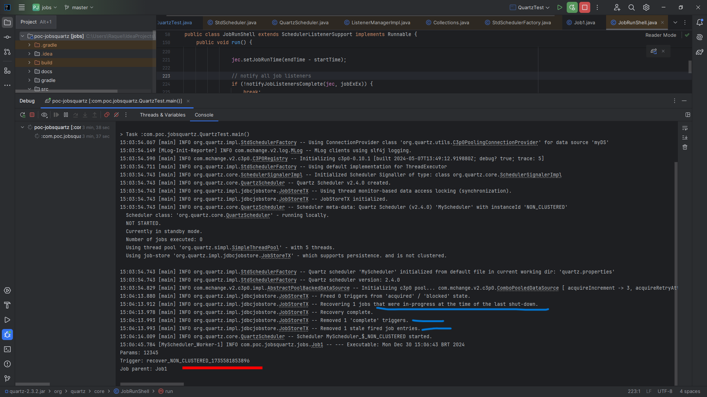

# POC - Jobs using Quartz lib

Creating and scheduling jobs on Quartz library in Java

* _Job_ is separate from a _Trigger_
* _SimpleTrigger_ performs a job only once
* _Job_ recovery if the application becomes unavailable (crashes, restart)

## Recovery

The _JDBCJobStore_ was configured to store everything that happens in the scheduler and to recover jobs and triggers interrupted during execution.

* Database _MySql_

